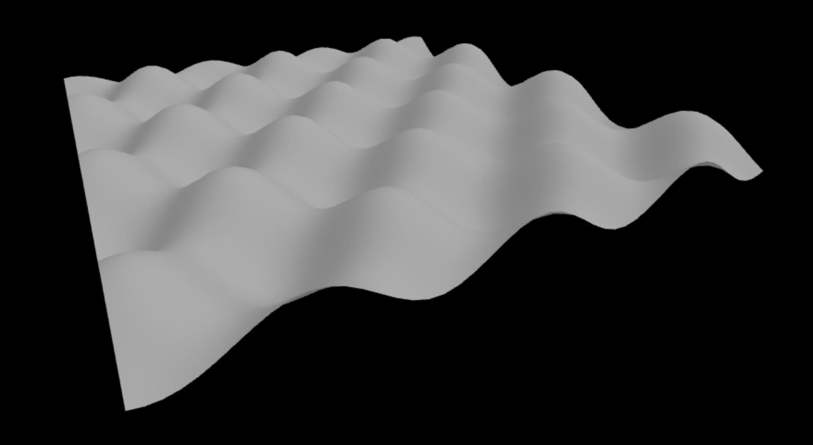

# Three.js Wavy Plane Visualizer

A dynamic 3D visualization that combines Bézier surfaces with animated wave patterns using Three.js. The project uses Bernstein polynomials to create a smooth parametric surface controlled by a 4x4 grid of control points, with an additional sinusoidal wave animation that creates mesmerizing flowing patterns. The result is an interactive 3D surface that users can explore with orbit controls.

## Installation

1. Clone the repository:
```bash
git clone https://github.com/yourusername/threejs-wave-plane.git
cd threejs-wave-plane
```

2. Install dependencies:
```bash
pnpm install
```

3. Start the development server:
```bash
npx vite
```

4. Open your browser and navigate to `http://localhost:5173`

